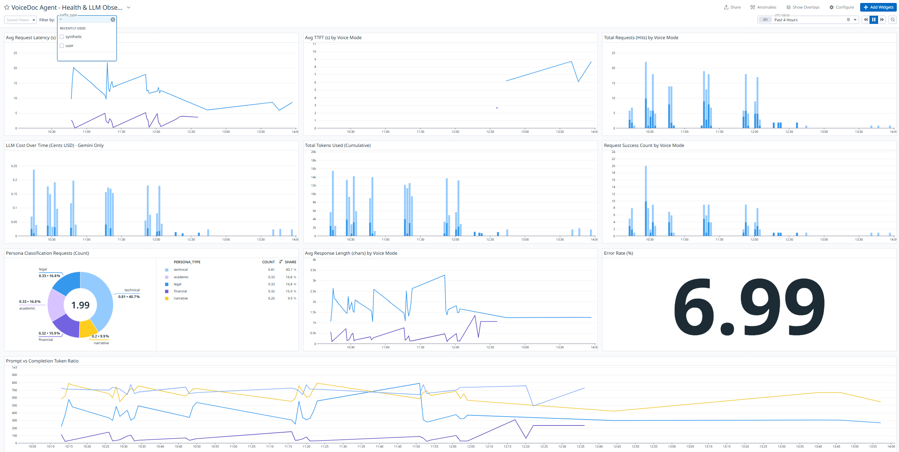

# VoiceDoc Dashboard - Widget Explanations

This dashboard provides **end-to-end observability** for VoiceDoc Agent, covering **latency, cost, reliability, persona usage, and expressive-voice impact**, split clearly by **Standard vs Expressive** voice modes.

## 1. Avg Request Latency (s) by Voice Mode

Measures the **end-to-end request latency** — from the start of LLM generation until the response stream completes — split by **Standard vs Expressive** voice modes.
* Expressed in seconds for readability
* Includes Gemini generation + post-processing
* Useful for identifying performance regressions when Expressive mode is enabled

**Expected**: Expressive mode slightly slower due to the two-pass emotion-tagging pipeline.

## 2. Avg TTFT (Time-to-First-Token) (s) by Voice Mode

Tracks **Time to First Token (TTFT)** — how long the user waits before hearing the first spoken output.
* A critical UX metric for **voice-native applications**
* Captures LLM + RAG + orchestration delay
* Split by voice mode to show the cost of expressiveness

**Key Insight**: Even with Expressive mode enabled, TTFT remains within acceptable conversational limits.

## 3. Total Requests (Hits) by Voice Mode

Tracks the **volume of incoming requests** over time, split by Standard vs Expressive mode.
* Displayed as bars to represent discrete events
* Helps visualize traffic patterns and feature adoption
* Useful for correlating load with latency or cost spikes

## 4. LLM Cost Over Time (Cents USD) - Gemini Only

Tracks **real-world Gemini API cost over time** (non-cumulative).
* Displayed in cents USD for clarity
* Split by voice mode
* Helps identify cost spikes caused by:
    * Larger RAG context
    * Expressive mode’s second LLM pass

## 5. Total Tokens Used (Cumulative)

Monitors **cumulative token usage** (prompt + completion) across all requests.
* Useful for quota management
* Reveals growth trends in system usage
* Helps validate context window sizing decisions

## 6. Request Success Count by Voice Mode

Counts how many requests **successfully completed end-to-end**, split by voice mode.
* Complements Error Rate
* Helps confirm system stability under load
* Sudden drops typically correlate with upstream LLM or network issues

## 7. Persona Classification Requests (Count)

Visualizes how often documents are classified into each persona:
* Legal
* Technical
* Academic
* Financial
* Narrative

Shown as a **pie chart**, where slice size represents proportional usage.

**Why it matters:**
Helps prioritize optimization for the most common document types.

## 8. Avg Response Length (chars) by Voice Mode

Tracks the **average character length** of AI responses.
* Demonstrates that **Expressive mode produces richer, more detailed output**
* Confirms that emotion tagging meaningfully changes generation behavior
* Useful for validating product differentiation claims

## 9. Error Rate (%)

A high-level **system health metric** showing the percentage of failed requests over the selected time window.  
Includes:
* Gemini timeouts
* API failures
* Forced or unexpected runtime errors

**Target**: Close to **0%**
Automatically scales based on the selected time range (1h, 4h, etc.).

## 10. Prompt vs Completion Token Ratio

Shows the ratio between **output tokens** and **input tokens**.
* Higher ratios indicate more verbose responses
* Helps tune:
    * RAG context size
    * Prompt design
    * Expressive vs Standard trade-offs

---

## Technical Visualization Notes

### Linear Interpolation & Gaps

Diagonal lines between distant data points are caused by **linear interpolation** during periods of inactivity.
* **Count-based metrics** (Hits, Cost, Success) intentionally use **bar charts**
* This avoids misleading diagonal “ramps” and keeps event data clear

### Anomaly Detection (Watchdog)

If you see **pink shading** or an **"Investigate"** label:
* Datadog Watchdog has detected a statistical anomaly
* Baselines are built from historical behavior
* Useful for spotting unexpected latency or cost spikes during testing

You can toggle anomaly overlays using the **"Anomalies"** switch in the dashboard.

---

## Summary: What This Dashboard Proves

This dashboard demonstrates that VoiceDoc Agent is:
* ✅ Observable at every layer (LLM, voice, persona, cost)
* ✅ Safe to scale (low error rate, predictable cost)
* ✅ Voice-native by design (TTFT-focused)
* ✅ Clearly differentiated via Expressive mode metrics