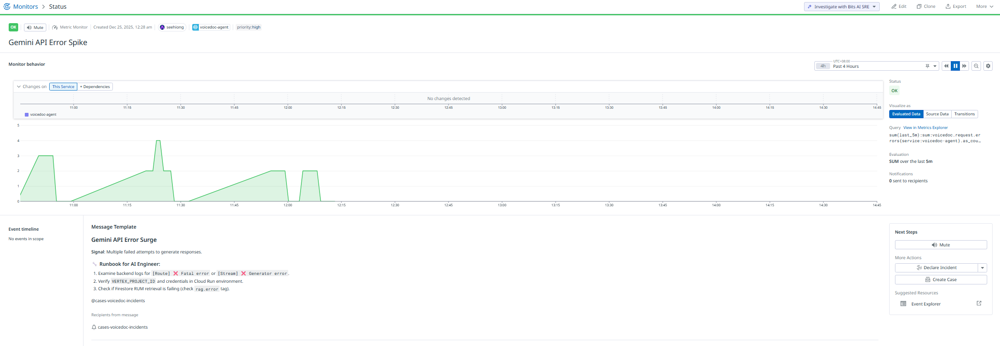
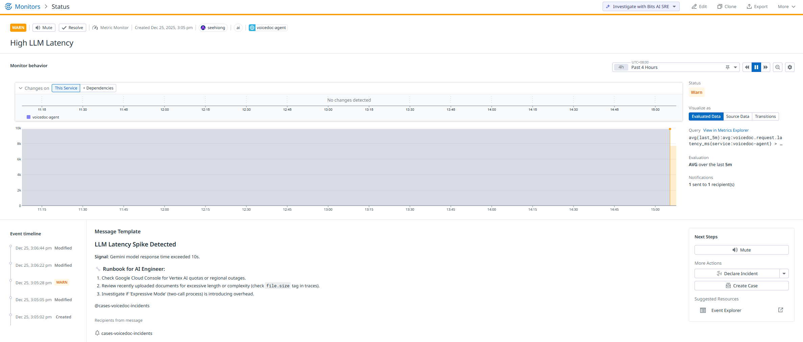
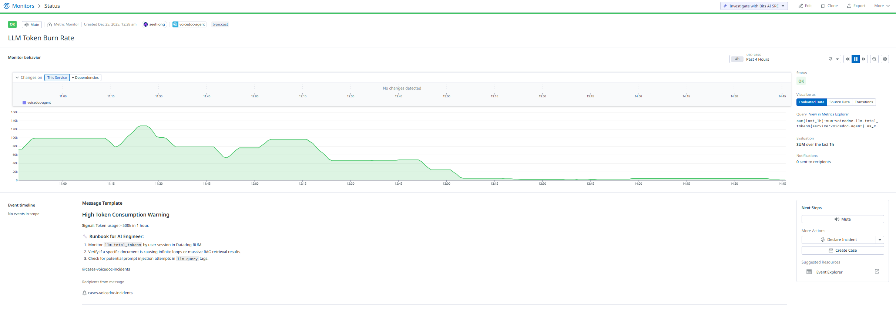

# 📡 Monitor Behavior Notes

## Why Some Monitors Show “NO DATA”

Certain monitors (such as **High LLM Latency**) rely on metrics that are only emitted **when a request completes**.

Because VoiceDoc Agent:
* Is event-driven
* Has bursty, demo-style traffic
* Does not generate constant background load

…it is normal for latency monitors to show **NO DATA** during idle periods.

**This indicates:**
* ✅ The system is idle
* ✅ No requests are currently violating thresholds
* ❌ Not a monitoring failure

Other monitors (such as **Error Rate** or **Token Burn Rate**) may still show data during the same time window because they rely on **counter-based metrics**, not request completions.

## Why We Do Not Treat “NO DATA” as Healthy

For observability correctness and safety:
* “**NO DATA**” ≠ “**Healthy**”
* It explicitly signals **lack of signal**, not a success rate
* This avoids false confidence during:
    * Traffic gaps
    * Partial outages
    * Upstream request stalls

Preserving the **NO DATA** state ensures the dashboard remains honest and production-ready.

## When This Will Disappear

Once VoiceDoc Agent:
* Experiences sustained real-world traffic
* Runs scheduled or background jobs
* Is deployed in a production environment

…the latency monitor will naturally transition from:

**NO DATA** → **OK** → **ALERT** 
based on actual request behavior.

## Why This Design Is Intentional

This monitoring setup reflects **real-world SRE best practices**:
* Latency alerts fire only when meaningful traffic exists
* Idle systems are not incorrectly marked as “healthy”
* Signal absence is treated as first-class information

## Why the High LLM Latency Monitor May Show WARN

Once real traffic is present, the **High LLM Latency** monitor will transition
from **NO DATA** to **WARN** or **ALERT** based on actual response times.

A **WARN** state indicates:

* ⚠️ Average request latency exceeded the warning threshold
* ✅ The monitor is functioning correctly
* ✅ Real user traffic is being evaluated

Common causes during development or demos:
* Cold starts on Vertex AI
* First-time document ingestion (large PDFs, embeddings)
* Expressive Mode using a two-pass LLM + TTS pipeline
* Regional model warm-up or quota throttling

A WARN does **not** imply system failure — it is an early signal for investigation.

> In early-stage or demo environments, WARN alerts are expected and useful for
> validating observability pipelines rather than indicating incidents.

